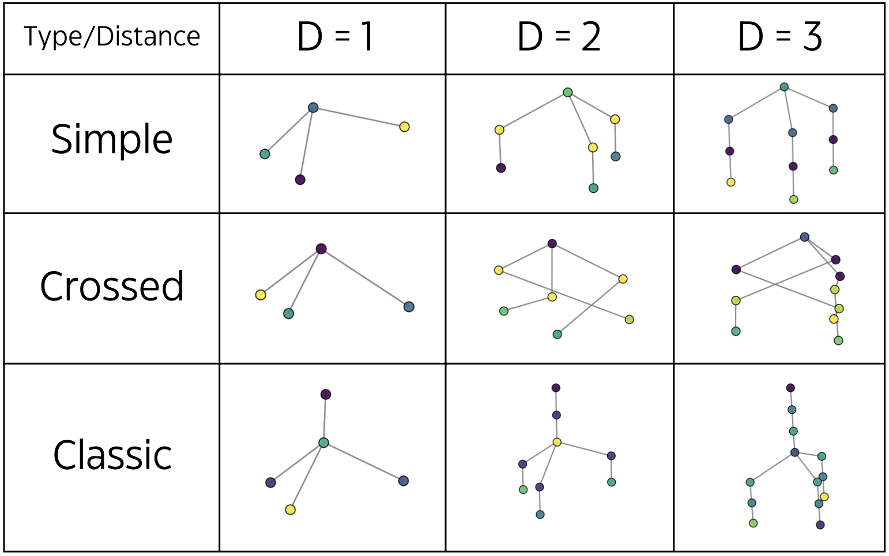

# Chi-Geometry
Welcome to **Chi-Geometry!** A repository to easily generate benchmark datasets for chiral-aware machine learning models.

Chi-Geometry lets you generate and explore chiral configurations without getting into the details of chemistry or chemical datasets/softwares. Also, it explores chirality in a purely geometric sense—ideal for testing model sensitivity to chirality without strict chemical constraints.



## Quick Start

Set up your environment, generate a dataset, and visualize it in just 3 steps:

```bash
# 1. Set up environment
conda env create -f environment.yml
conda activate chi-geometry

# 2. Generate dataset
cd dataset
python create_dataset.py

# 3. Visualize dataset (optional)
python plot.py
```

## Configurations

There are three key configurations inside of Chi-Geometry: Type, Distance, and Species-Range

(1) Type: Type allows some flexibility in terms of the chiral configuration which is set up. There are the simple configurations, which have no complexities. They have the chiral center and 3 chains of subtituents, no more complexity. Crossed configurations also just have a chiral center and 3 substituent chains, but the connections are crossed in-between the chains. Classic configurations are modelled after how we actually find chirality in chemistry. Although chirality only takes 3 substituents to exist, in chemistry, it usually happens with 4, so the classic configurations have 4 substituent chains. NOTE: explain substituents or use easier wording. 
(2) Distance: Distance shows the amount of connections away the chirality exists. In all types, the intermediate layers between the chiral center and the chiral substituents are all the same atom, hence providing no distinction between chiral configurations until the end points in the substituent chains. NOTE: explain this better and more succinctly here.
(3) Species Range: The amount of possible node types that can be randomly chosen to make the chiral configuration.
